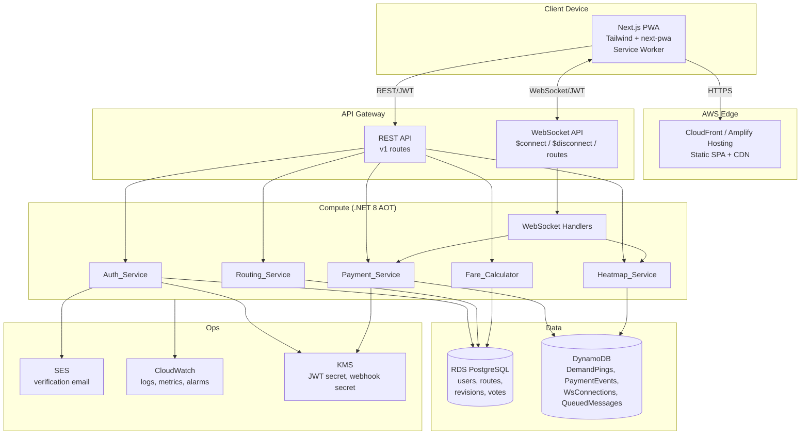
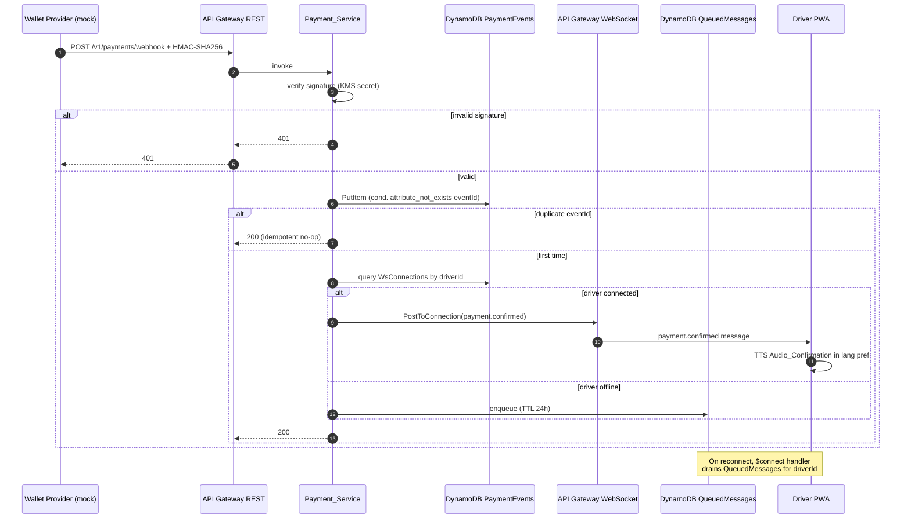
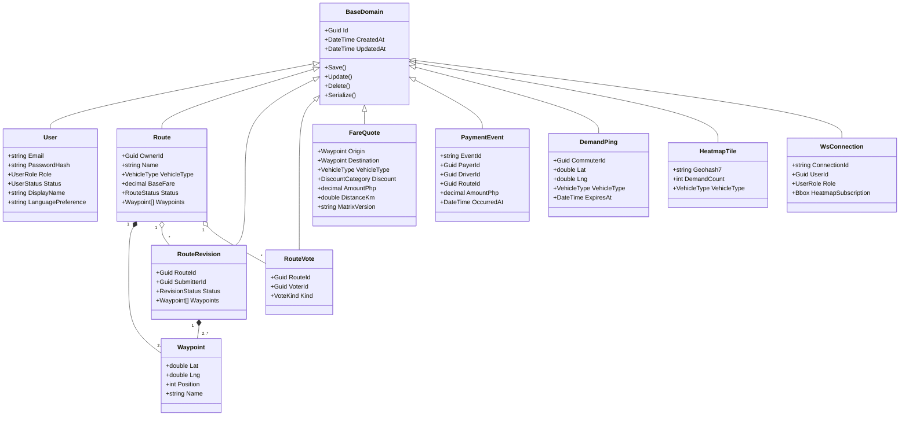

# Design Document

## Overview

BiyaHero is a mobile-first Progressive Web App that gives Filipino jeepney commuters and PUV drivers four tools they currently lack: a community-edited route wiki, a deterministic LTFRB fare estimator, an unforgeable real-time payment confirmation that defeats the "123 scam," and a live demand heatmap that closes the gap between waiting commuters and circling drivers. The MVP ships against four problem domains — Community-Sourced Routing, Anti-Scam Fare Calculator, Anti-123 Payment Notifications, and Heatmap Dispatcher — with a strict separation between a thin Next.js + Tailwind PWA shell and a hardcore C# .NET 8 backend on AWS. The architectural philosophy is "dumb UI, hardcore backend": all business rules, validation, geospatial math, fare logic, idempotence, and security live server-side; the PWA is a presentation, capture, and offline-replay layer that holds no truth of its own. Real-time fan-out runs through AWS API Gateway WebSockets; relational data sits in RDS PostgreSQL and ephemeral hot data sits in DynamoDB. The MVP is engineered to fit the AWS Free Tier under the Req 7.4 ceiling (≤1000 MAU, ≤500k pings/month) for as long as the free tier remains in effect.

## Stack Decision

The compute layer is the single biggest cost lever for a long-running side project on the AWS Free Tier. Three options were evaluated for hosting the .NET 8 Web API.

| Option | Pros | Cons | Free Tier Behavior |
|---|---|---|---|
| **Elastic Beanstalk (EC2 t4g.micro)** | Simplest .NET deploy story; persistent process; warm reqs ~50ms; no AOT trim warnings; familiar to .NET devs | Charges for EC2 hours after 12 months; idle cost continues even at 0 RPS; vertical scaling only on free tier | 750 EC2 hours/month for 12 months only — **expires** |
| **App Runner** | Fully managed; auto-deploys from container; HTTPS + autoscale built-in | No free tier — billed per vCPU-second and GB-second from request 1; lowest viable cost > $0/month at idle | **No free tier** |
| **Lambda + API Gateway + .NET 8 Native AOT** | Perpetual free tier; scales to zero; cold start ~200–400ms with AOT; pay-per-request matches MVP traffic | AOT trim warnings on some libs (e.g., reflection-heavy ORMs); cold-start tax on first request after idle; AOT build complexity | **1M req + 400k GB-s/month perpetually free** |

**Recommendation: Lambda + API Gateway + .NET 8 Native AOT** for the REST surface. WebSocket fan-out goes through API Gateway WebSocket APIs in all three options, so that decision is independent. .NET 8 native AOT compiles to a small, fast-starting Linux ARM64 binary that fits well inside the 400k GB-s/month allowance at MVP load (1000 MAU, ~30 req/user/day ≈ 900k req/month, comfortably under the 1M free invocations). For ORM access, prefer Dapper or AOT-compatible Entity Framework configurations to avoid trim warnings.

**Fallback:** if AOT trim warnings on required dependencies become unfixable or cold-start latency materially hurts the Doherty-threshold UX target on first map load, switch to **Elastic Beanstalk t4g.micro** with the same .NET 8 codebase. The application is structured so that swapping the host is a deployment concern only — no domain code changes.

## Architecture



The PWA loads from CloudFront, then talks to two API Gateway endpoints: a REST API for synchronous calls (auth, route CRUD, fare estimates) and a WebSocket API for real-time flows (demand pings, heatmap subscriptions, payment confirmations). All compute lives in a single .NET 8 codebase deployed as Lambda functions, sliced by feature subsystem. Hot ephemeral data (pings, payment events, connection IDs, queued offline messages) lives in DynamoDB to exploit on-demand pricing and TTL; relational data (users, routes, revisions, votes, audit log) lives in RDS PostgreSQL with PostGIS. SES handles transactional email, CloudWatch handles logs/metrics/alarms, and KMS holds JWT and webhook signing secrets.


## AWS Data Path Flows

**Login & JWT issuance.** The PWA POSTs `/v1/auth/sessions` over CloudFront → API Gateway REST → the Auth Lambda. The handler loads the user row from RDS, verifies the password with Argon2id, fetches the HS256 signing secret from KMS, and returns a 24-hour JWT access token plus a 30-day refresh token. The PWA stores both in IndexedDB and attaches the access token as a Bearer header on every subsequent REST call.

**Route submission and bounding-box query.** A Commuter POSTs `/v1/routes` with name, vehicle type, ordered waypoints, and base fare. The Routing handler validates the waypoints (≥2, lat 4.5°–21.5° N, lng 116°–127° E), persists the Route + Waypoint rows to RDS in a single transaction with status `unverified`, and returns the created entity. A subsequent `GET /v1/routes?bbox_sw=…&bbox_ne=…` query runs a PostGIS `ST_Intersects` against the GiST-indexed `geometry(Point, 4326)` column on `route_waypoints`, returning all intersecting routes within the Req 1.2 p95 ≤ 800ms target.

**Fare calculation.** A `POST /v1/fare/:calculate` call carries origin, destination, vehicle type, and optional discount category. The Fare handler loads the active LTFRB matrix version from a versioned config table, computes the haversine distance on WGS84, applies the minimum-fare floor, the per-km increment, the discount percentage, and rounds to the nearest 25 centavos. The response includes the computed fare, distance in km, and the matrix version used. The handler is pure (no I/O after the matrix load) so the Req 2.10 determinism property holds.

**Demand_Ping submission via WebSocket.** A connected Commuter sends `{"action":"demand-ping","lat":…,"lng":…,"vehicleType":…}` over the WebSocket. The handler validates coordinates against the Philippines bounding box, writes the ping to DynamoDB `DemandPings` with a 5-minute TTL, and returns a confirmation. Pings outside the valid range are rejected without persistence (Req 4.8).

**Heatmap subscription and push update.** A Driver sends `{"action":"subscribe-heatmap","bbox":{…}}`. The handler stores the subscription on the connection record in `WsConnections`. A scheduled aggregator (Lambda on a 5-second EventBridge cadence) reads `DemandPings`, groups by geohash precision 7 within the bbox, and pushes deltas back through `PostToConnection` to subscribed drivers. Heatmap responses contain only counts and geohashes — never commuter IDs or device IDs (Req 4.6).

**Payment webhook → Audio_Confirmation.** This is the most complex flow and the core of the Anti-123 feature. A signed webhook from the wallet adapter triggers a chain of validation, persistence, fan-out, and TTS playback on the driver's device.



## Components and Interfaces

This section covers the project layout, the REST surface, and the WebSocket protocol — the three external interfaces a developer or integrator interacts with.

### Project Structure

```
biyahero/
├── apps/
│   ├── web/                          # Next.js PWA, Tailwind, next-pwa
│   │   ├── app/                      # App router pages
│   │   ├── components/               # Dumb UI primitives
│   │   ├── features/                 # Feature slices (route-plot, fare-calc, heatmap, payment-dashboard, auth, settings)
│   │   ├── locales/                  # en.json, fil.json
│   │   ├── lib/                      # API client, IndexedDB queue, SW registration
│   │   ├── public/                   # manifest.json, icons, sw.js
│   │   └── tailwind.config.ts
│   │
│   └── api/                          # C# .NET 8 backend, feature-sliced
│       ├── BiyaHero.Api/
│       │   ├── Features/
│       │   │   ├── Auth/             # endpoints, handlers, schemas
│       │   │   ├── Routing/
│       │   │   ├── Fare/
│       │   │   ├── Payment/
│       │   │   ├── Heatmap/
│       │   │   └── Common/
│       │   ├── Domain/               # Pure domain classes : BaseDomain
│       │   ├── Repositories/         # IRepository<T> + Pg/Dynamo impls
│       │   ├── Services/             # SDK boundary (boto3-equivalent SDKs only here)
│       │   └── WebSockets/           # $connect, $disconnect, route handlers
│       └── tests/                    # FsCheck property tests + xUnit examples
│
├── infra/                            # AWS CDK (C#)
│   ├── BiyaHero.Infra/
│   └── cdk.json
│
└── docs/
```

The web app is feature-sliced per the React/Vite SPA steering. The .NET API is feature-sliced per the OOP steering: `Domain` holds plain entities inheriting from `BaseDomain` with `Find`, `FindAll`, `Create`, `Where`, `Save`, `Update`, `Delete`, `Serialize`; `Repositories` abstract the data store so handlers never touch SDK calls directly; `Services` is the only layer where the AWS SDK appears.

### REST API Surface

All paths are `/v1/{subsystem}/{resource}`, kebab-case plural, custom methods use `POST` + colon syntax.

| Method | Path | Auth | Description | Status Codes |
|---|---|---|---|---|
| POST | `/v1/auth/registrations` | none | Create account, send verification email | 201, 409, 422 |
| POST | `/v1/auth/email-verifications/:verify` | none | Consume verification token | 200, 401, 422 |
| POST | `/v1/auth/sessions` | none | Login, returns JWT + refresh token | 200, 401, 422 |
| POST | `/v1/auth/sessions/:refresh` | refresh JWT | Issue new access token | 200, 401 |
| DELETE | `/v1/auth/sessions/{id}` | JWT | Logout, revoke refresh token | 204, 401 |
| GET | `/v1/auth/me` | JWT | Current user profile | 200, 401 |
| PATCH | `/v1/auth/me/language-preference` | JWT | Update `en` or `fil` | 200, 401, 422 |
| GET | `/v1/routes` | optional | Bbox query, returns routes intersecting bbox | 200, 422 |
| POST | `/v1/routes` | JWT | Submit new route (status `unverified`) | 201, 401, 422 |
| GET | `/v1/routes/{id}` | optional | Fetch single route | 200, 404 |
| POST | `/v1/routes/{id}/revisions` | JWT | Submit pending edit | 201, 401, 404, 422 |
| POST | `/v1/routes/{id}/revisions/{rid}/:approve` | JWT (Moderator) | Apply revision, mark verified | 200, 401, 403, 404 |
| POST | `/v1/routes/{id}/votes` | JWT | Cast accuracy vote | 201, 401, 404, 422 |
| POST | `/v1/fare/:calculate` | none | Compute fare from origin/destination/vehicle/discount | 200, 400, 422 |
| POST | `/v1/payments/webhook` | HMAC-SHA256 | Wallet adapter callback | 200, 401 |
| GET | `/v1/heatmap/tiles` | none | Bbox query, geohash7 demand counts | 200, 422 |
| GET | `/v1/health` | none | DB + WS dependency status | 200 |
| GET | `/v1/admin/users` | JWT (Super Admin) | List users for management | 200, 401, 403 |
| POST | `/v1/admin/users/{id}/:suspend` | JWT (Super Admin) | Suspend account | 200, 401, 403, 404 |
| POST | `/v1/admin/users/{id}/:promote` | JWT (Super Admin) + 2FA password | Change role (Super Admin promotion requires re-entered password per Req 5.11) | 200, 401, 403, 404, 422 |

### WebSocket Protocol

Connection URL: `wss://{api-id}.execute-api.{region}.amazonaws.com/prod?token={jwt}`. The JWT is validated in the `$connect` handler; missing, expired, or invalid tokens cause a 4001 close.

| Route Key | Direction | Purpose |
|---|---|---|
| `$connect` | client → server | Authenticate, register `connectionId` in `WsConnections`, drain `QueuedMessages` for user |
| `$disconnect` | client → server | Remove `connectionId` from `WsConnections` |
| `ping` | client → server | Liveness; server replies `pong` |
| `subscribe-heatmap` | client → server | Driver subscribes to bbox heatmap deltas |
| `demand-ping` | client → server | Commuter submits Demand_Ping |
| `cancel-demand` | client → server | Commuter cancels active ping |
| `heatmap.delta` | server → client | Push aggregated tile updates |
| `payment.confirmed` | server → client | Anti-123 payment confirmation envelope |

All messages share a JSON envelope `{ "action": "<route-key>", "requestId": "<uuid>", "data": { … } }`. Server-pushed messages add `"emittedAt": "<iso8601>"`.

**Queue-on-disconnect behavior.** When `Payment_Service` cannot find an active `WsConnection` for the target driver, it writes the envelope to `QueuedMessages` keyed by `driverId` with a 24-hour TTL (Req 3.6). On the driver's next `$connect`, the handler queries `QueuedMessages` for that `driverId`, replays each message in `occurredAt` order through `PostToConnection`, and deletes the queue entries on successful delivery.

## Data Models

### Domain Model



Per the OOP steering, every domain class inherits from `BaseDomain` and exposes the standard interface (`Find`, `FindAll`, `Create`, `Where` as static; `Save`, `Update`, `Delete`, `Serialize` as instance). Domain classes are not 1:1 with database tables — `Route` aggregates its `Waypoints`, but the storage layer splits them across `routes` and `route_waypoints` tables. Repositories own the translation between storage and domain so handlers never touch SQL or DynamoDB SDK calls directly.

### PostgreSQL Schema

PostGIS extension is enabled. The `route_waypoints.location` column is `geometry(Point, 4326)` with a GiST index to satisfy the Req 1.2 p95 ≤ 800ms bbox-query target.

**`users`**

| Column | Type | Constraints |
|---|---|---|
| id | uuid | PK |
| email | citext | UNIQUE NOT NULL |
| password_hash | text | NOT NULL (Argon2id) |
| role | user_role enum | NOT NULL — `commuter` \| `driver` \| `moderator` \| `super_admin` |
| status | user_status enum | NOT NULL — `pending_verification` \| `active` \| `suspended` |
| display_name | text | NOT NULL |
| language_preference | char(3) | NOT NULL DEFAULT `'fil'` CHECK in (`'en'`,`'fil'`) |
| created_at, updated_at | timestamptz | NOT NULL |

Index: `users_email_idx` on `email`.

**`routes`**

| Column | Type | Constraints |
|---|---|---|
| id | uuid | PK |
| owner_id | uuid | FK → `users.id` |
| name | text | NOT NULL |
| vehicle_type | vehicle_type enum | NOT NULL |
| base_fare_centavos | integer | NOT NULL CHECK (≥ 0) |
| status | route_status enum | NOT NULL — `unverified` \| `verified` |
| created_at, updated_at | timestamptz | NOT NULL |

Indexes: `routes_owner_idx`, `routes_status_idx`.

**`route_waypoints`**

| Column | Type | Constraints |
|---|---|---|
| id | uuid | PK |
| route_id | uuid | FK → `routes.id` ON DELETE CASCADE |
| position | integer | NOT NULL — ordering within route |
| name | text | nullable |
| location | geometry(Point, 4326) | NOT NULL |
| UNIQUE (route_id, position) | | |

Indexes: `route_waypoints_location_gix` GiST on `location`; `route_waypoints_route_idx` on `route_id`.

**`route_revisions`**

| Column | Type | Constraints |
|---|---|---|
| id | uuid | PK |
| route_id | uuid | FK → `routes.id` |
| submitter_id | uuid | FK → `users.id` |
| status | revision_status enum | `pending` \| `approved` \| `rejected` |
| approver_id | uuid | nullable, FK → `users.id` |
| created_at, updated_at | timestamptz | NOT NULL |

**`route_revision_waypoints`**

| Column | Type | Constraints |
|---|---|---|
| id | uuid | PK |
| revision_id | uuid | FK → `route_revisions.id` ON DELETE CASCADE |
| position | integer | NOT NULL |
| name | text | nullable |
| location | geometry(Point, 4326) | NOT NULL |
| UNIQUE (revision_id, position) | | |

**`route_votes`**

| Column | Type | Constraints |
|---|---|---|
| id | uuid | PK |
| route_id | uuid | FK → `routes.id` |
| voter_id | uuid | FK → `users.id` |
| kind | vote_kind enum | `still_accurate` \| `no_longer_accurate` |
| created_at | timestamptz | NOT NULL |
| UNIQUE (route_id, voter_id) | | — one vote per user per route |

**`audit_log`**

| Column | Type | Constraints |
|---|---|---|
| id | uuid | PK |
| actor_id | uuid | FK → `users.id` |
| action | text | NOT NULL |
| target_type | text | NOT NULL |
| target_id | uuid | nullable |
| occurred_at | timestamptz | NOT NULL |
| metadata | jsonb | nullable |

Mirrored to a CloudWatch log group for Super Admin actions (Req 5.10) — table is the queryable system-of-record, CloudWatch is the immutable append-only sink.

**Lat/lng B-tree fallback.** If PostGIS cannot be enabled on the chosen RDS engine, the schema falls back to two `double precision` columns `lat` and `lng` on `route_waypoints` with a composite B-tree index. Bounding-box queries become `WHERE lat BETWEEN ? AND ? AND lng BETWEEN ? AND ?`. This works at MVP scale but degrades sub-linearly: a B-tree composite index uses only the leading column for range scans, so the planner reads roughly all rows in the latitude band and filter-evaluates longitude — a measurable hit at >100k waypoints. PostGIS GiST is strongly preferred for nationwide growth.

### DynamoDB Schema

All tables use on-demand capacity and DynamoDB Streams off by default.

**`DemandPings`** — supports Req 4.1, 4.4 (TTL), 4.5 (cancel), 4.10 (conservation).

| Attribute | Role |
|---|---|
| `pk` (String) | `GEOHASH#{geohash5}` — coarse spatial bucket for tile-aggregation scans |
| `sk` (String) | `PING#{commuterId}#{pingId}` |
| `lat`, `lng`, `vehicleType`, `submittedAt` | item attributes |
| `expiresAt` (Number, epoch s) | TTL attribute, 5 min after submission |
| GSI `byCommuterId` | PK `commuterId` → fast cancel by commuter (Req 4.5) |

Geohash-5 prefix (~5 km cell) is the partition key so a bbox aggregation scans a bounded set of partitions; geohash-7 (~150 m cell) is computed at aggregation time for the response (Req 4.2).

**`PaymentEvents`** — supports Req 3.1, 3.7 (idempotence), 3.10/3.11 (round-trip).

| Attribute | Role |
|---|---|
| `pk` (String) | `EVENT#{eventId}` — webhook-supplied unique id, conditional `attribute_not_exists` write enforces idempotence |
| `sk` (String) | `EVENT#{eventId}` (single-item; same as pk for simple GetItem) |
| `payerId`, `driverId`, `routeId`, `amountCentavos`, `occurredAt`, `signatureVerifiedAt` | item attributes |
| GSI `byDriverId` | PK `driverId`, SK `occurredAt` — driver dashboard history |
| `expiresAt` (Number, epoch s) | TTL 90 days (Req 8.2) |

Single-item per `eventId` with conditional put is the canonical idempotent-webhook pattern.

**`WsConnections`** — supports Req 3.2, 3.6, 4.3, 5.4.

| Attribute | Role |
|---|---|
| `pk` (String) | `USER#{userId}` |
| `sk` (String) | `CONN#{connectionId}` |
| `role`, `connectedAt`, `heatmapBboxSw`, `heatmapBboxNe` | item attributes |
| GSI `byConnectionId` | PK `connectionId` → fast `$disconnect` cleanup |
| `expiresAt` (Number, epoch s) | TTL 24h safety net for orphaned connections |

User-keyed PK lets `Payment_Service` look up "is this driver connected?" with a single Query.

**`QueuedMessages`** — supports Req 3.6.

| Attribute | Role |
|---|---|
| `pk` (String) | `USER#{driverId}` |
| `sk` (String) | `MSG#{occurredAt}#{eventId}` — chronological order on Query |
| `envelope` (Map) | full WebSocket message payload |
| `expiresAt` (Number, epoch s) | TTL 24h (Req 3.6) |

Drains in `occurredAt` order on `$connect`, ensuring delivery order matches webhook order.

## Localization

- Bundle layout: `apps/web/locales/en.json`, `apps/web/locales/fil.json`, versioned and shipped with the build (Req 10.8).
- Runtime swap via `next-intl` provider; UI updates within 100ms without page reload (Req 10.3).
- Default detection on first load: `navigator.language.startsWith('en')` → `en`, otherwise `fil` (Req 10.2).
- localStorage mirror on every change for offline / next-load defaulting (Req 10.5); on login, server-stored preference overrides the local mirror within 1s (Req 10.4).
- Missing keys fall back to English at render time and POST the missing key to `/v1/i18n/missing-keys` (handled by Auth subsystem) for translator backfill (Req 10.6).
- Initial bundles cover navigation, route plotting, fare calculation, payment dashboard, heatmap controls, login/registration, settings, error messages, offline indicator (Req 10.7).

## Security Design

- **JWT HS256** access + refresh tokens; signing secret stored in **AWS KMS**, never in env vars or source.
- **Argon2id** with `memoryCost ≥ 64 MiB`, `iterations ≥ 3`, `parallelism ≥ 1`; meets Req 5.7 ("at least cost factor 12" interpreted via Argon2id memory-hard equivalent).
- **TLS 1.2+** terminated at API Gateway and CloudFront (Req 8.4); HTTP redirected to HTTPS at the edge.
- **Audit log** mirrored to a dedicated CloudWatch log group with 30-day retention (Req 5.10, 8.5); Super Admin writes, Payment_Service writes, and Auth_Service writes all flow there with caller identity, endpoint, timestamp, and outcome.
- **Webhook signature** is HMAC-SHA256 over the raw request body using a KMS-stored shared secret; signature in `X-Wallet-Signature` header, timestamp in `X-Wallet-Timestamp` checked against ±5-minute window to block replays.
- **Super Admin promotion** requires the acting admin to re-enter their own password as a 2FA confirmation step before the role change is applied (Req 5.11).

## Free-Tier Consumption Estimate

Projected at the Req 7.4 ceiling: 1000 MAU, 500k Demand_Pings/month, ~30 REST req/user/day.

| Service | Free Tier Allowance | Projected MVP Usage | Headroom |
|---|---|---|---|
| RDS db.t4g.micro | 750 hours/month (12 mo) | 730 h (one always-on instance) | comfortable, but **expires month 12** |
| RDS storage (gp3) | 20 GB (12 mo) | <2 GB at MVP scale | comfortable |
| DynamoDB on-demand | 25 WCU + 25 RCU baseline always-free + 25 GB storage | 500k pings × 1 WCU + ~200k WSConn ops + 30k payment events ≈ ~750k writes/mo (well under 25 WCU baseline of 25 × 86400 × 30 = 64.8M req-units) | comfortable, perpetual |
| API Gateway REST | 1M req/month (12 mo) | ~900k req/month | tight, **expires month 12** |
| API Gateway WebSocket | 1M messages + 750k connection-min (12 mo) | ~600k messages + ~500k conn-min | comfortable, **expires month 12** |
| Lambda | 1M req + 400k GB-s/month always-free | ~1.5M invocations × ~256 MB × ~200 ms ≈ ~75k GB-s | comfortable, perpetual |
| CloudFront | 1 TB egress + 10M req/month (12 mo) | <50 GB | comfortable, **expires month 12** |
| SES | 200 outbound emails/day from EC2/Lambda | ~1000 verifications/month ≈ 33/day | comfortable |
| CloudWatch Logs | 5 GB ingest + 5 GB storage | ~1–2 GB at audit-log volume | comfortable |
| KMS | 20k req/month always-free | ~1M req at 1 sig per JWT issue → exceeds | **needs caching** — cache verification key in-process |

**Month-12 free-tier cliff.** RDS hours, API Gateway free quota, and CloudFront 12-month allowances expire on the AWS account's first anniversary. After that, RDS db.t4g.micro alone is roughly $13/month and API Gateway shifts to $1.00 per million REST calls + $1.00 per million WS messages. Lambda, DynamoDB on-demand baseline, and a small CloudWatch tier remain perpetually free. The expected monthly run-rate post month 12 at MVP scale is in the low double digits of USD; the migration path off RDS is to Aurora Serverless v2 with auto-pause, or to a self-hosted Postgres on a t4g.small with Reserved Instance pricing.

## Error Handling

The error model is centralized so handlers raise typed exceptions and a single middleware translates them to consistent HTTP and WebSocket envelopes.

**REST error envelope** — every non-2xx response returns `{ "error": { "code": "<machine-code>", "message": "<human-message>", "details": { … } } }`.

| Condition | Status | `error.code` |
|---|---|---|
| Missing/expired/invalid JWT (REST) | 401 | `auth.unauthenticated` |
| Insufficient role | 403 | `auth.forbidden` |
| Resource not found | 404 | `resource.not_found` |
| Existing email on registration | 409 | `auth.email_conflict` (does not reveal verification status, Req 5.5) |
| Invalid coords / unsupported vehicle / <2 waypoints | 422 | `input.validation_failed` |
| Malformed request (wrong content-type, missing fields) | 400 | `request.malformed` |
| Webhook signature invalid/missing | 401 | `payment.signature_invalid` (no fan-out, Req 3.5) |
| Health-check dependency degraded | 200 | `/v1/health` always 200 with per-dependency status (Req 7.6) |
| Unexpected server failure | 500 | `server.internal` |

**WebSocket close codes** — `4001` for any auth failure (`$connect` without valid JWT, unauthenticated `demand-ping`); the underlying socket is force-closed even if the close-frame fails to deliver (Req 4.7).

**Idempotence and partial failure.** The Payment_Service uses a DynamoDB conditional write (`attribute_not_exists(eventId)`) so duplicate webhook deliveries return 200 with no side effects (Req 3.7). If the conditional write succeeds but `PostToConnection` fails, the message is enqueued in `QueuedMessages` and replayed on reconnect — the system never silently drops a confirmed payment.

**Audio fallback.** If the driver client cannot play TTS audio (muted device, autoplay blocked), the PWA renders a high-contrast banner and POSTs the failure to a backend logging endpoint (Req 3.8) so failed audio confirmations are observable in CloudWatch.

**Offline write replay.** PWA write failures while offline are queued in IndexedDB and replayed in submission order on reconnect (Req 6.4); replay errors surface to the user as in-app notifications and are logged centrally rather than silently retried forever.

## Testing Strategy

**Unit tests (xUnit, .NET).** Per-handler tests covering specific examples, role-gated branches, and edge-case inputs. The Auth, Routing, Fare, and Payment subsystems each have a `tests/Features/{Subsystem}/` folder mirroring the feature-slice layout. Mock the AWS SDK and database at the repository boundary so handler tests stay fast and deterministic.

**Property-based tests (FsCheck, .NET).** Live under `apps/api/tests/Properties/`. Each test runs ≥100 iterations and is tagged `Feature: biyahero-mvp, Property {n}: {text}` so the trace links back to the design property. The four properties enumerated in the Correctness Properties section are the entire PBT scope for MVP.

**Integration tests (xUnit + Testcontainers).** A docker-compose harness brings up local PostgreSQL with PostGIS and a DynamoDB Local container, and the Auth/Routing/Heatmap subsystems run end-to-end against them. The Anti-123 flow has a dedicated integration test that exercises webhook → DynamoDB → mocked WebSocket fan-out.

**Frontend component and accessibility tests (Vitest + Testing Library + axe).** Every feature slice has a component test for happy path and at least one error path. axe-core runs in CI on a representative page set to enforce Req 9.2 (WCAG AA contrast and accessible-name coverage).

**PWA audits.** Lighthouse PWA audit runs in CI on the production build; the score gate is "no failing PWA installability checks" per Req 6.6. A separate Playwright offline scenario verifies the cached shell loads with `network: offline` and that an offline write replays correctly on reconnect.

**Load tests (k6).** Three scenarios are scripted against a staging deployment and run before each release: (1) REST mixed workload at 50 concurrent users to verify the Req 7.2 p95 ≤ 400ms target, (2) WebSocket fan-out at 200 concurrent connections to verify the Req 7.3 zero-drop target, and (3) Heatmap aggregation at 500k pings/month rate to verify the Req 4.2 p95 ≤ 500ms target.

**Smoke tests.** Post-deploy smoke checks hit `/v1/health`, perform a login, submit and read back a route, and open and close a WebSocket connection. Failure pages a notification channel.

## Correctness Properties

*A property is a characteristic or behavior that should hold true across all valid executions of a system — essentially, a formal statement about what the system should do. Properties serve as the bridge between human-readable specifications and machine-verifiable correctness guarantees.*

PBTs live under `apps/api/tests/` using **FsCheck** for .NET, configured for ≥100 iterations per property. Each test is tagged `Feature: biyahero-mvp, Property {n}: {text}`.

### Property 1: Round-trip Route serialization

*For all* valid `Route` entities with at least two valid waypoints, parsing the JSON produced by the Route serializer and re-serializing the parsed Route produces semantically equivalent JSON.

**Validates: Requirements 1.10, 1.11**

### Property 2: Round-trip PaymentEvent serialization

*For all* valid `PaymentEvent` entities, parsing the JSON produced by the PaymentEvent serializer and re-serializing the parsed event produces semantically equivalent JSON.

**Validates: Requirements 3.10, 3.11**

### Property 3: Determinism of fare calculation

*For all* valid `(origin, destination, vehicleType, discount)` input tuples, two invocations of `Fare_Calculator.Calculate` against the same LTFRB matrix version return identical results.

**Validates: Requirements 2.10**

### Property 4: Conservation of heatmap aggregation

*For all* sequences of valid Demand_Ping submissions, cancellations, and TTL expirations within an arbitrary 60-second window, the sum of demand counts across all Heatmap_Tile aggregations equals the count of submitted pings minus the count of pings removed by cancellation or TTL.

**Validates: Requirements 4.10**

Other acceptance criteria (UI rendering, PWA installability, role-based access, bbox bounds checks) are covered by example-based xUnit tests, integration tests, and Lighthouse audits — PBT is reserved for the four universal-quantification properties above.

## Open Risks / Future Work

- **Real wallet sandbox availability.** GCash and Maya developer sandboxes are gated; the MVP ships behind a swappable adapter so the mock can be replaced post-MVP, but onboarding to a real provider is a non-engineering blocker.
- **PostGIS opt-in vs lat/lng fallback.** If RDS PostGIS is unavailable on the chosen instance class, the lat/lng B-tree fallback is correct but degrades at scale; a follow-up benchmarking task should confirm acceptable p95 against representative data before national rollout.
- **Free-tier cliff at month 12.** Cost forecasting, Aurora Serverless v2 evaluation, and Reserved Instance pricing should be revisited at month 9.
- **Geographic expansion onboarding.** Metro Manila is the launch market, but the system already accepts Philippines-wide submissions; an onboarding/marketing strategy for other regions (Cebu, Davao, Iloilo) is out of scope for MVP and needs its own discovery.

## Follow-up: Code Samples

Runnable starter code is intentionally omitted from this design to keep it focused on architecture and decisions. Once this design is approved, a follow-up delivery will create the following files:

- `apps/web/next.config.js` — next-pwa configuration, headers, i18n base
- `apps/web/public/manifest.json` — Web App Manifest (Req 6.1)
- `apps/web/public/sw.js` — Service Worker registration shim and cache-first strategy (Req 6.2, 6.3)
- `apps/api/BiyaHero.Api/WebSockets/ConnectHandler.cs` — `$connect` JWT validation and queue drain
- `apps/api/BiyaHero.Api/WebSockets/PaymentBroadcastHandler.cs` — webhook → `PostToConnection` fan-out
- `apps/api/BiyaHero.Api/Features/Heatmap/SubscribeHeatmapHandler.cs` — bbox subscription registration
- `infra/BiyaHero.Infra/Stacks/ApiStack.cs` — API Gateway REST + WebSocket + Lambda wiring
- `infra/BiyaHero.Infra/Stacks/DataStack.cs` — RDS PostgreSQL + DynamoDB tables + KMS keys
